# The King of Elfland's Daughter — Chapters II–III, as a manhwa

A 38-panel vertical-scroll comic, drawn in the style of a Korean webtoon. Every panel was generated locally with **Qwen-Image 2.1** in ComfyUI, with character sheets passed in as reference images so the same hero appears in every panel. Speech bubbles are placed by a face detector so they never cover a face.

Made for the Pi Percent Human video *Making a Full Manhwa Chapter on My Own PC with Qwen-Image 2.1*, which covers the setup, the script, the mistakes the model made and what fixed them.

**Story:** adapted from Lord Dunsany, *The King of Elfland's Daughter* (1924), chapters II–III — public domain, [Project Gutenberg #61077](https://www.gutenberg.org/ebooks/61077). The forest dragon is our addition, not Dunsany's.

**Images:** generated with [Qwen-Image 2.1](https://huggingface.co/Qwen/Qwen-Image-2.1), which is released under the Qwen Research License (non-commercial). Shared here for reading, not for commercial use.

Read top to bottom:

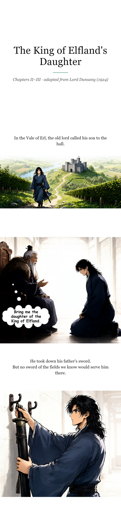

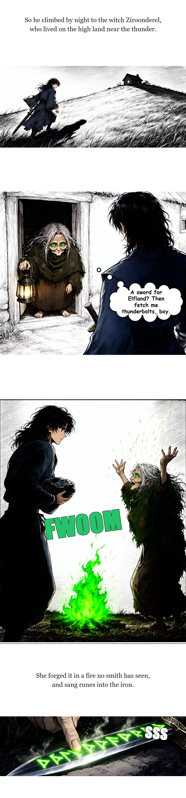

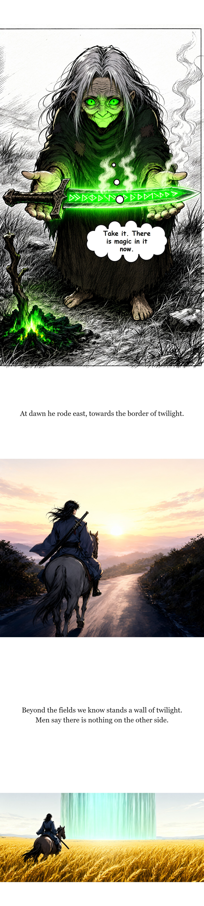

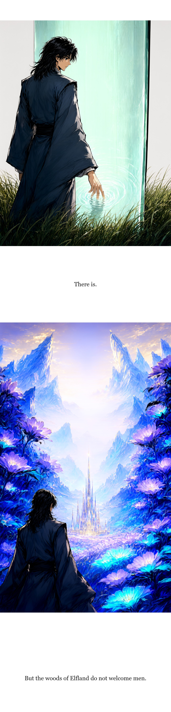

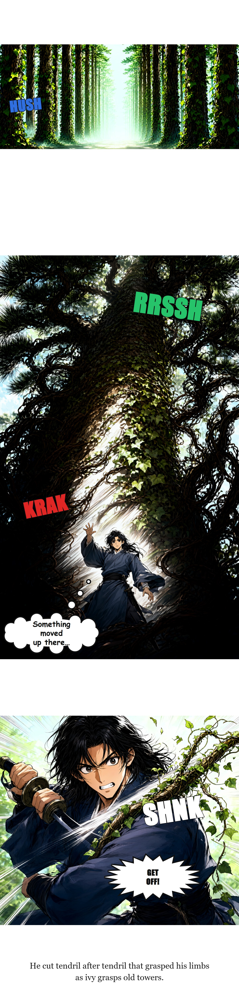

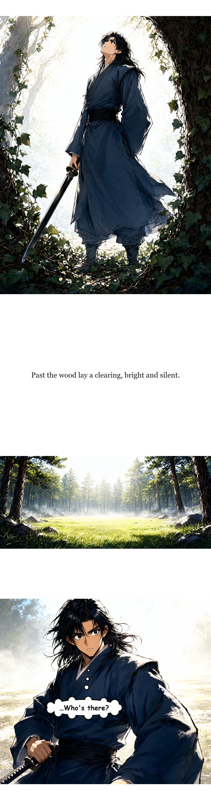

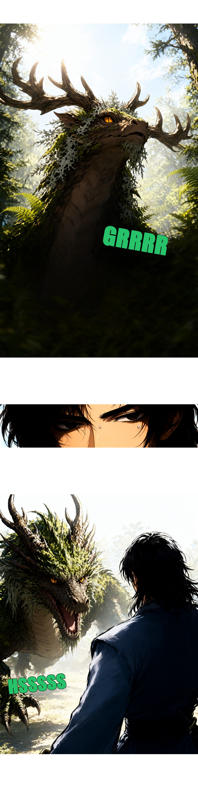

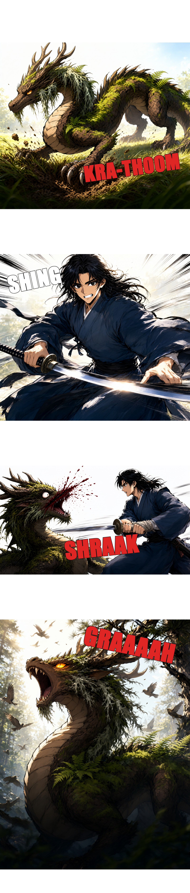

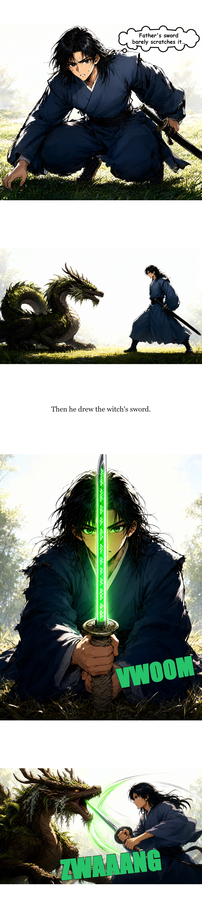

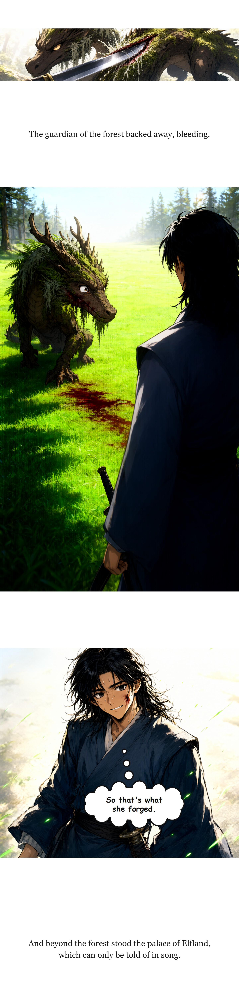

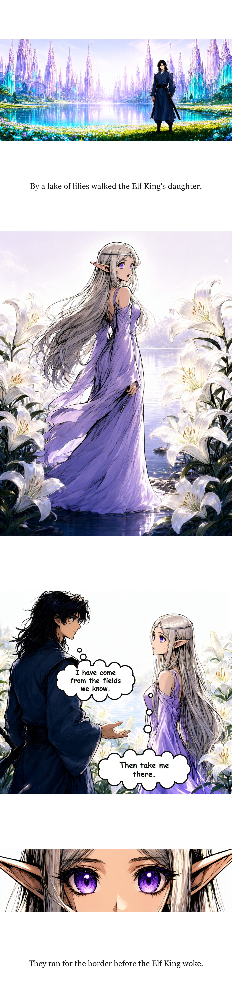

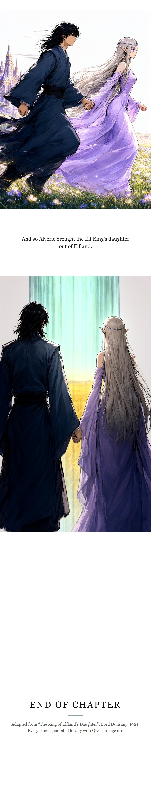

